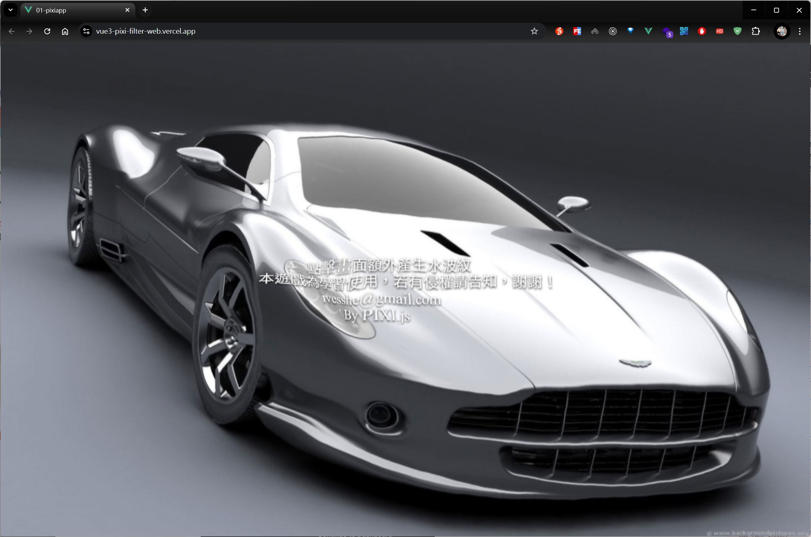
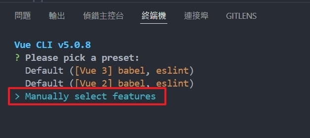
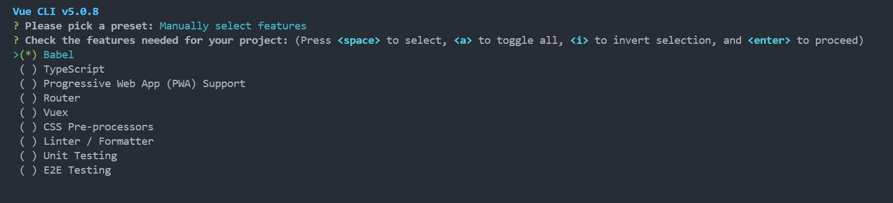
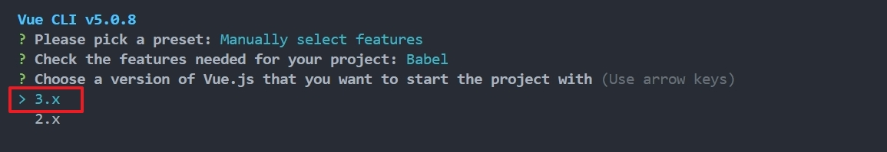
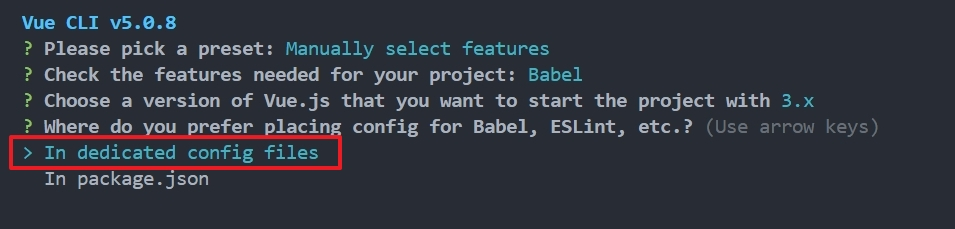

# Vue3 Pixi Filter

Vue3搭配Pixi.js製作Filter水波紋

# 展示網址
https://vue3-pixi-filter-web.vercel.app/



# 安裝Vue CLI
```shell
npm install -g @vue/cli

```

# 建立Vue3專案

```shell
vue create 01-pixiapp
```
選擇vue3，只選用babel









# 安裝yarn

```shell
npm i yarn -g 
```

# 安裝pixi

```shell
yarn add pixi.js@7.1.1
```

# 安裝pixi濾境

```shell
yarn add pixi-filters@5.1.1
```

# 運行

```shell
cd 目錄
yarn serve
```

vue3新專案


 
 # Script


```js
// 導入pixi.js
import * as PIXI from 'pixi.js'
import { ShockwaveFilter } from "pixi-filters"

// 創建應用
const app = new PIXI.Application({
  width: window.innerWidth,
  height: window.innerHeight,
  backgroundColor: 0x1099bb,
  resolution: window.devicePixelRatio||1,
  antialias: true,  //抗鋸齒
})

// 將應用畫布添加到DOM中
document.body.appendChild(app.view)

// 創建一個紋理
const texture = PIXI.Texture.from("./textures/car.jpg")

// 創建一個精靈
const sprite = new PIXI.Sprite(texture)
sprite.width = app.screen.width
sprite.height = app.screen.height

// 創建容器
const container = new PIXI.Container()
container.addChild(sprite)
app.stage.addChild(container)

// 添加文字
const text = new PIXI.Text(
  `               點擊畫面額外產生水波紋
  本遊戲為學習使用，若有侵權請告知，謝謝！
                  ivesshe@gmail.com
                         By PIXI.js`,
  {
    fontFamily: "Ariel",
    fontSize: 30,//+Math.floor(app.screen.width*0.1),
    fill: 0xffffff,
    aglin: "center",
    dropShadow: true,
    dropShadowColor: "#000000",
    dropShadowBlur: 4,
    dropShadowAngle: Math.PI/2,
    dropShadowDistance: 2,
    
  }  
)
text.x = app.screen.width/2;
text.y = app.screen.height/2;
text.anchor.set(0.5);
container.addChild(text)

// 添加置換濾境
const displacementSprite = PIXI.Sprite.from("./textures/displacement.jpg")
displacementSprite.scale.set(0.5)
displacementSprite.texture.baseTexture.wrapMode = PIXI.WRAP_MODES.REPEAT
const displacementFilter = new PIXI.DisplacementFilter(displacementSprite)
container.addChild(displacementSprite)


// 添加震波濾境
const shockwaveFilter1 = new ShockwaveFilter(
  [
    Math.random()*app.screen.width,
    Math.random()*app.screen.height,
  ],
  {
    radius: 80,        // 半徑
    wavaLength: 40,   // 波長
    amplitude: 100,    // 振幅
    speed: 200,
  },
  0
)

const shockwaveFilter2 = new ShockwaveFilter(
  [
    Math.random()*app.screen.width,
    Math.random()*app.screen.height,
  ],
  {
    radius: 100,        // 半徑
    wavaLength: 45,   // 波長
    amplitude: 80,    // 振幅
    speed: 240,
  },
  0
)

const shockwaveFilter3 = new ShockwaveFilter(
  [
    Math.random()*app.screen.width,
    Math.random()*app.screen.height,
  ],
  {
    radius: 160,        // 半徑
    wavaLength: 65,   // 波長
    amplitude: 45,    // 振幅
    speed: 300,
  },
  0
)

container.filters = [
  displacementFilter,
  shockwaveFilter1,
  shockwaveFilter2,
  shockwaveFilter3,
]
 
app.ticker.add((delta)=>{
  displacementSprite.x += 1
  displacementSprite.y += 1
  createWave(shockwaveFilter1,1);
  createWave(shockwaveFilter2,1.2);
  createWave(shockwaveFilter3,0.7);
})
 
function createWave(waveFilter,resetTime){
  waveFilter.time += 0.01
  if(waveFilter.time > resetTime){
    waveFilter.time = 0
    waveFilter.center = [
      Math.random() * app.screen.width,
      Math.random() * app.screen.height,
    ]
  }
}


// 監聽點擊事件，根據位置創建震波濾鏡
app.view.addEventListener("pointerdown",(e)=>{
  shockwaveFilter1.center = [e.clientX,e.clientY]
  shockwaveFilter1.time = 0
  console.log("@@@點擊了!!",e.clientX,e.clientY)
})


 ```
